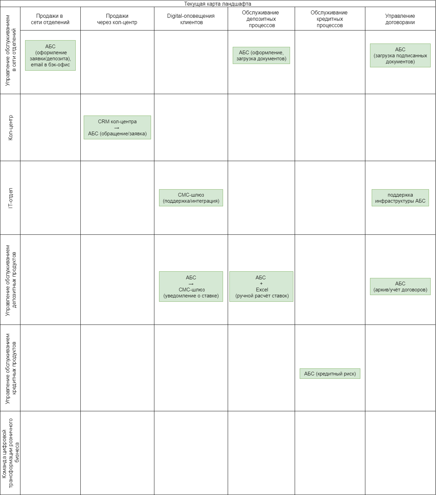
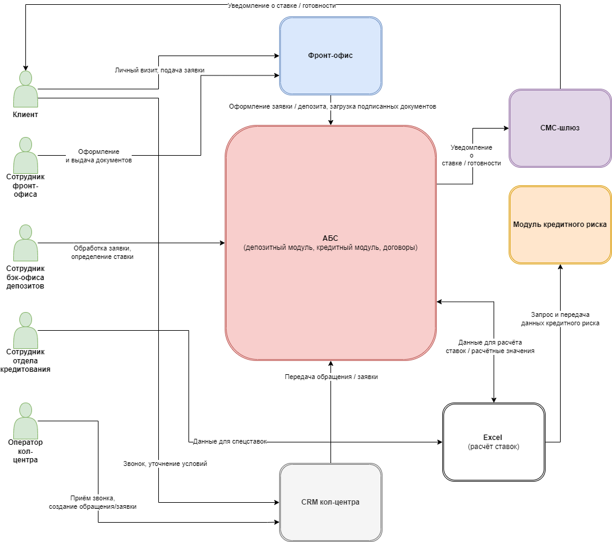

# Task 1 — Карта текущего IT-ландшафта и схема интеграции приложений

## Цель
Определить текущее состояние IT-ландшафта банка «Стандарт» и построить схему интеграции приложений, участвующих в процессе открытия депозитов и накопительных счетов. Это необходимо для выявления узких мест и планирования цифровой трансформации.

## Выполненные шаги

### 1. Построена карта текущего IT-ландшафта
- В **строках** размещены элементы организационной структуры: подразделения банка, задействованные в процессе.
- В **колонках** указаны бизнес-возможности второго уровня, взятые из карты бизнес-возможностей.
- На пересечениях отмечены IT-системы, которые используются данным подразделением для реализации конкретной бизнес-возможности.
- Зеленым цветом выделены ячейки, где используется конкретная система или инструмент.
- Пустые ячейки означают, что подразделение не задействовано в реализации данной бизнес-возможности.

#### Карта текущего IT-ландшафта

### 2. Построена схема интеграции приложений
- Схема отображает **только взаимодействие систем между собой**, без прямых связей между подразделениями.
- Слева размещены ключевые персоны (для контекста).
- В центральной и правой части расположены блоки систем:  
  - Фронт-офис (АРМ в АБС)  
  - CRM кол-центра  
  - АБС (депозитный модуль, кредитный модуль, договоры)  
  - Excel (ручной расчет ставок)  
  - Модуль кредитного риска  
  - СМС-шлюз
- Стрелками показаны потоки данных и действий между системами, с подписями, указывающими, что именно передается.
- Персоны соединены только со своими рабочими системами, через которые они участвуют в процессе.

#### Схема интеграции приложений

## Результат
В результате получены:
1. Карта текущего IT-ландшафта, показывающая, какие системы используются в каких подразделениях для выполнения конкретных бизнес-возможностей.
2. Схема интеграции приложений, отражающая текущее взаимодействие систем при открытии депозитов.

Обе диаграммы будут использоваться на следующих этапах проекта для планирования целевого состояния архитектуры и проектирования автоматизации.
