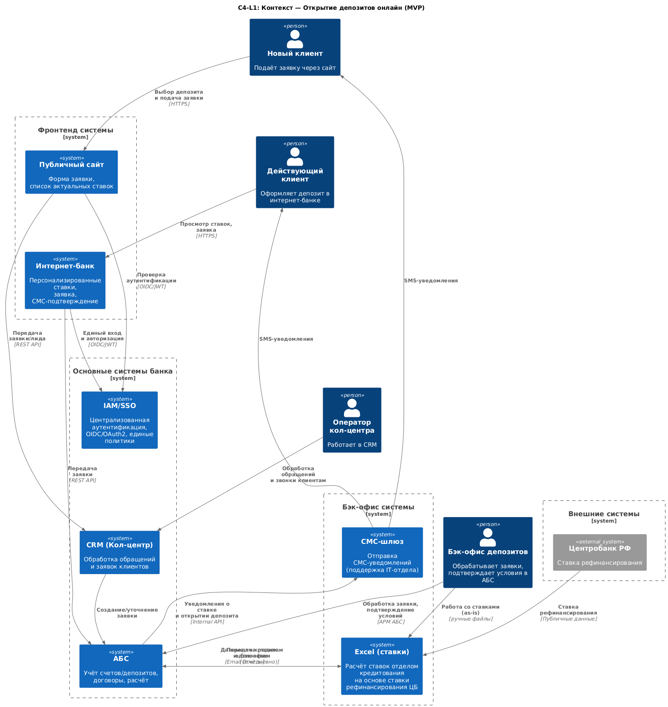
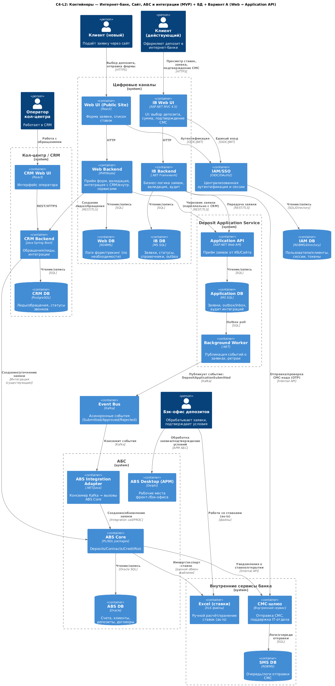

# Task 3 — Открытие депозитов онлайн: ADR

### **Название задачи:** Открытие депозитов онлайн — концептуальная архитектура MVP 
### **Автор:** Архитектор
### **Дата:** 08.12.2025
---
### **Функциональные требования**

Опишите здесь верхнеуровневые Use Cases. Их нужно оформить в виде таблицы с пошаговым описанием:

|**№**|**Действующие лица или системы**|**Use Case**|**Описание**|
| :-: | :- | :- | :- |
|1 |	Новый клиент, Сайт, CRM кол-центра, АБС|Подача заявки через сайт|Клиент выбирает депозит, заполняет форму (ФИО, телефон), данные шифруются и передаются в CRM кол-центра. Оператор связывается с клиентом, при необходимости уточняет условия, создаёт заявку в АБС.|
|2| 	Действующий клиент, Интернет-банк, АБС | Подача заявки через интернет-банк | Клиент видит актуальные и персонализированные ставки, выбирает счёт и сумму депозита, подтверждает операцию СМС-кодом. Данные передаются в АБС, менеджер бэк-офиса подтверждает условия.|
|3| 	АБС, СМС-шлюз, Клиент | Уведомление об открытии депозита| После подтверждения депозита АБС инициирует отправку СМС через СМС-шлюз с информацией о ставке и готовности депозита. |
---
### **Нефункциональные требования**
Опишите здесь нефункциональные требования и архитектурно значимые требования.
- Архитектурно-значимые нефункциональные требования (по сути из FURPS+ Task 2)
  
|**№**|**Требование**|
| :-: | :- |
|1 |	Шифрование данных при передаче (TLS 1.2+/1.3) для сайта и интернет-банка.|
|2|	Подтверждение операции через СМС-код (MFA).|
|3|	Разделение доступа (RBAC/ABAC) для бэк-офиса депозитов и кредитов.|
|4|	Избегать прямых запросов интернет-банка к API АБС (через очередь/шину или промежуточный сервис).|
|5|	Использование существующих технологий банка (MS SQL, Oracle, ASP.NET MVC).|
---
### **Решение**
Приведите диаграммы контекста и контейнеров в модели C4. Опишите там основные компоненты и интеграции всех элементов решения. 

#### Context diagram

#### Container diagram

Также опишите, какой логикой вы руководствовались в ходе принятия решений и выбора технологий. Не забывайте, что необходимо учесть все функциональные и нефункциональные требования.

### Логика архитектурных решений и выбор технологий

#### Ведущие принципы

**Соответствие MVP**: реализуем только то, что критично для запуска, подача заявок онлайн, ручная обработка в АБС, СМС‑подтверждение и уведомления.

**Минимум изменений в ядрах**: максимально используем существующие системы (АБС, интернет‑банк, CRM, СМС‑шлюз), не ломая текущие процессы.

**Разделение ответственности и слабая связность**: каналы (Сайт/ИБ) отделены от бэк‑офисной обработки; обмен через промежуточный слой и шину событий.

**Надёжность и масштабируемость**: исключаем прямые синхронные зависимости от АБС; критичные компоненты можно масштабировать горизонтально.

**Безопасность и комплаенс**: шифрование трафика, подтверждение операций, контроль доступа, аудит.

## Привязка к функциональным требованиям

**Сайт для новых клиентов и Интернет‑банк для действующих**: обеспечиваем два канала подачи заявки (Use Case 1 и 2).

**СМС‑подтверждение и уведомления**: используем существующий СМС‑шлюз банка; ИБ инициирует OTP (One-Time Password), АБС отправляет статусные уведомления.

**Ручная обработка в бэк‑офисе**: АБС остаётся источником истины; Excel для ставок сохраняется as‑is (MVP).

## Привязка к нефункциональным требованиям (FURPS+)

**Performance**: убираем «долгие» ожидания в UI (асинхронная подача заявки), используем кэш на стороне каналов (справочники/ставки).

**Reliability/Availability**: 24/7 и 99,9%  > достигается за счёт разрыва жёсткой синхронной сцепки с АБС и применения шины событий (см. ниже).

**Supportability**: опираемся на стек банка (ASP.NET MVC/.NET, MS SQL, Oracle), добавляя слой, который вписывается в существующую экспертизу.

**Security**: TLS 1.2+/1.3, OTP (One-Time Password) через СМС, IAM/SSO (поэтапно), RBAC/ABAC для бэк‑офиса, аудит (события входа, заявки, изменения ставок).

### Ключевые решения по компонентам

#### Интернет‑банк (UI/Backend + IB DB, MS SQL)

Выбран, поскольку уже существует, поддерживается и соответствует сценарию для действующих клиентов. Backend получает и валидирует заявки, подтверждает операции через OTP, пишет в свою БД и публикует в Application API (далее в Event Bus).

#### Промежуточный слой Deposit Application Service (API + Worker + Application DB)

**Зачем**: отделить каналы от ядра АБС, чтобы:
- а) сгладить пики нагрузки;
- б) не блокировать клиента задержками АБС;
- в) унифицировать «конвейер» заявок (в т.ч. будущие каналы).

**Как**: API принимает заявки из ИБ (и опционально с сайта), Worker публикует события в шину, хранит outbox/inbox и аудит интеграций.

#### Event Bus — Kafka (шина событий)

##### Почему Event Bus (Kafka):

**Слабая связность и независимость**: каналы (ИБ/Сайт) и АБС развязываются во времени и по SLA; сбой/пауза АБС не «роняет» фронты.

**Высокая доступность**: Kafka поддерживает кластеризацию и репликацию; при недоступности потребителя (адаптера/АБС) события надёжно хранятся и будут обработаны позже.

**Горизонтальная масштабируемость**: при росте нагрузки добавляем партиции и консьюмеры, не трогая каналы.

**Back‑pressure и ретраи**: естественная модель очередей позволяет контролировать скорость потребления, делать повторные попытки и DLQ.

**Расширяемость**: к тем же событиям можно будет подключить аналитику, оповещения, витрины статусов без модификации каналов.

**Компромисс MVP**: даже если текущий ИБ несовместим с Kafka напрямую, публикация идёт через Application Service/Worker, это сохраняет архитектурную цель, не ломая текущие ограничения.

#### ABS Integration Adapter

Отдельный потребитель Kafka, который переводит события «заявка создана/обновлена» в вызовы ABS Core (PL/SQL/процедуры).

**Зачем не писать в АБС напрямую из Worker**:
- изоляция контрактов и ретраев;
- удобное логирование/аудит интеграции;
- возможность менять детали интеграции, не затрагивая каналы и общую шину.

#### CRM (Кол‑центр)

Сайт продолжает создавать лиды в CRM (as‑is), чтобы оператор кол‑центра сохранял текущий процесс. Дополнительно, по «Варианту A», сайт отправляет черновик заявки в Application API для унифицированного трекинга, это не ломает CRM‑процесс и готовит переход к полной автоматизации.

#### СМС‑шлюз (внутренний)

Используем существующий сервис для OTP и уведомлений, что снижает риски и ускоряет MVP. Логи/очереди в собственной БД шлюза при необходимости.

#### Excel со ставками (as‑is)

На этапе MVP сохраняем ручной расчёт и обмен файлами между кредитным и депозитным бэк‑офисом, чтобы не расширять скоуп. При этом архитектура допускает последующую миграцию ставок в встроенный сервис (в АБС или отдельный сервис с API).

#### IAM/SSO

Подключаем к UI каналов (SAML/OIDC), унифицируя вход. Для MVP допускается постепенное включение, чтобы не блокировать старт; авторизация для бэк‑офиса через существующие механизмы АБС.

#### Почему отказались от прямых синхронных вызовов ИБ → АБС

**Надёжность/доступность**: АБС перегружена и масштабируется только вертикально; прямые вызовы повышают риск деградации каналов.

**UX**: длительные ответы ухудшают отклик интерфейса; асинхронная постановка в очередь даёт мгновенный ответ пользователю.

**Эволюция**: с шиной событий проще добавлять новые каналы и потребители, чем «раскручивать» точка‑к‑точке интеграции.

#### Соответствие требованиям SLA и масштабируемости

**99,9% на каналах** достигается за счёт независимости от бэк‑офиса: даже при недоступности АБС заявки будут приняты и надёжно зафиксированы в очереди.

**Горизонтальный скейл**: фронты (Web/IB), Application API и Worker масштабируются горизонтально; Kafka по партициям; адаптер по числу консьюмеров.

**Вертикальные ограничения АБС** нивелируются буферизацией событий и планированием потребления.

#### Безопасность

TLS 1.2+/1.3, OTP для подтверждения операций, сегментация сети (DMZ/внутр. контур), минимальные привилегии для сервисных аккаунтов.

**Аудит**: фиксация событий (кто/что/когда), трассировка заявок (корреляционные ID в цепочке Web/IB → Application → Kafka → ABS).

**Совместимость стеков**: MS SQL/Oracle, .NET/ASP.NET, Java — соответствуют экспертизе команд и ограничениям инфраструктуры.

#### Итог

Выбор Event Bus (Kafka) и промежуточного Application Service обеспечивает независимость каналов от АБС, соответствие требованиям по доступности и масштабируемости, улучшает UX за счёт мгновенного приёма заявок и создаёт предсказуемую основу для последующей полной автоматизации (перевод ставок из Excel, SSO, единая витрина статусов) без переделки существующих систем.

---
### **Альтернативы**
Опишите здесь наиболее важные альтернативные решения.

- Прямое подключение интернет-банка к АБС (отказались из-за нагрузки).

- Хранение ставок в отдельной БД вместо интеграции с АБС (отказались из-за дублирования данных).

**Недостатки, ограничения, риски**

Подробно опишите здесь недостатки, ограничения и риски выбранного решения.

- Ограничения:
  - АБС масштабируется только вертикально.
  - Kafka пока несовместима с интернет-банком.

- Риски:
  - Возможная задержка при ручной обработке заявок.
  - Перегрузка АБС при большом количестве заявок.

- Недостатки:
  - В MVP нет полной автоматизации, участие бэк-офиса обязательно.

