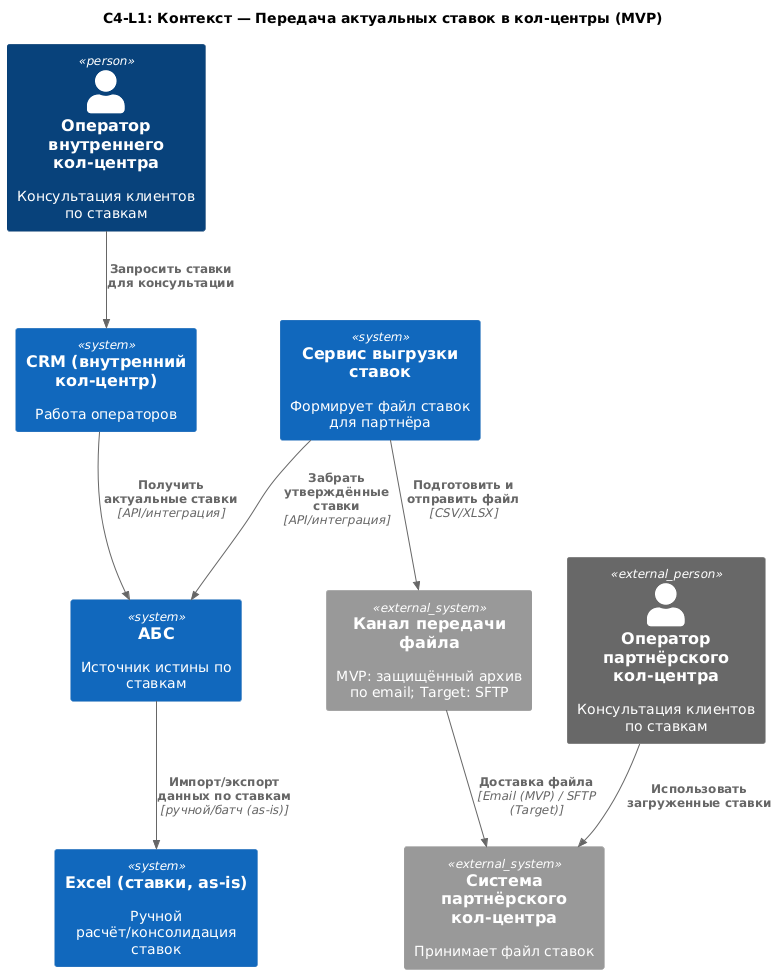
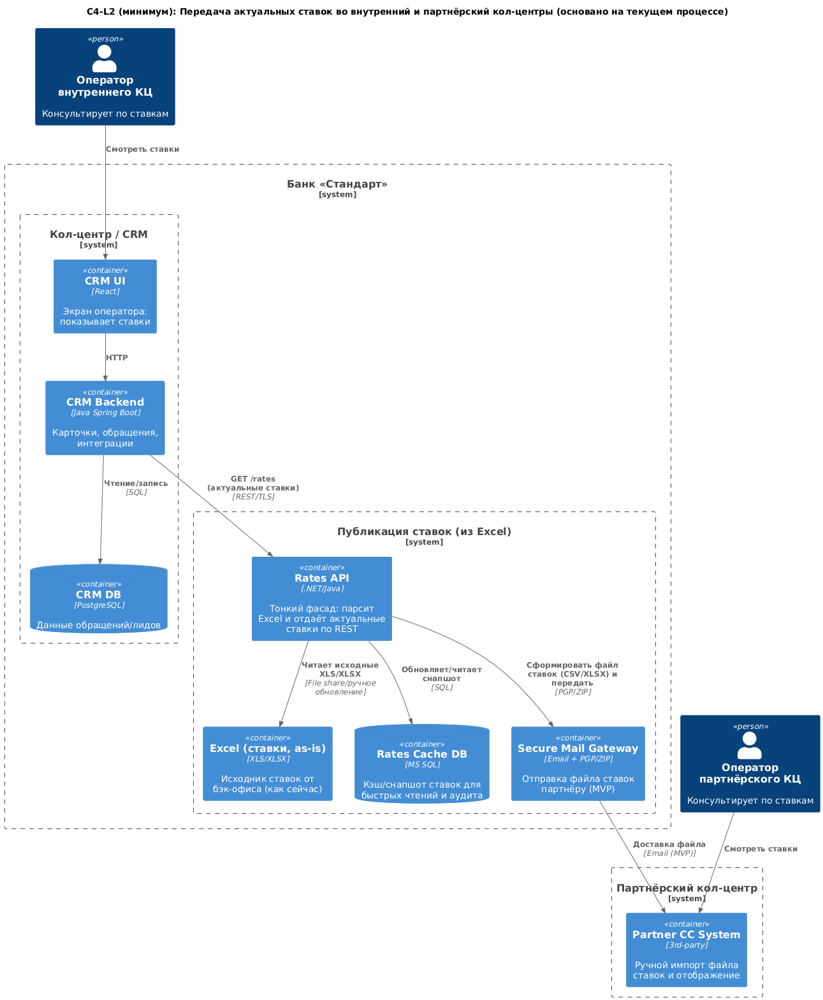
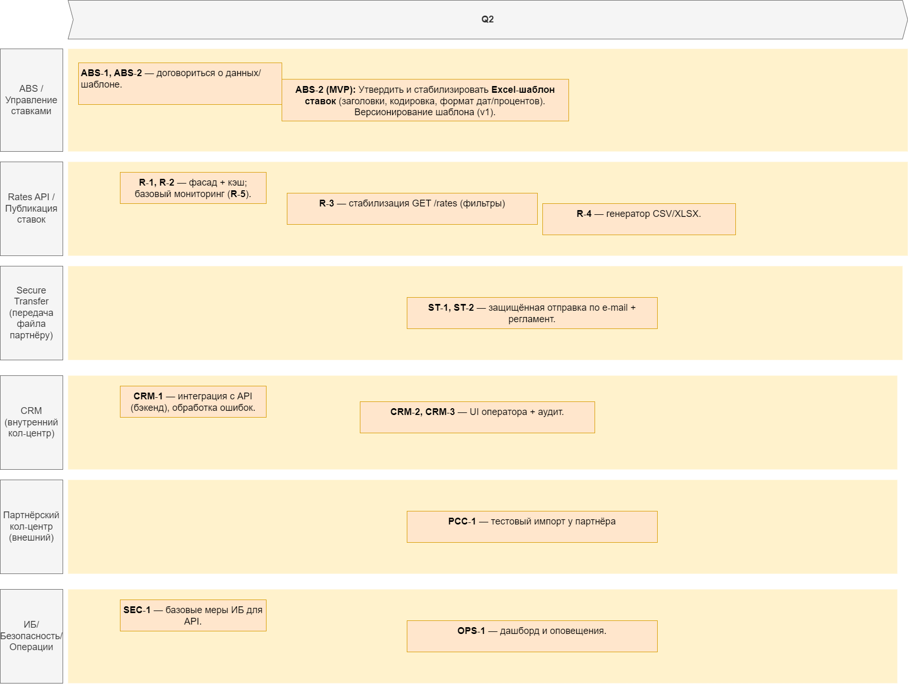

### **Название задачи:** Передача актуальных ставок депозитов во внутренний и партнёрский кол-центры
### **Автор:** Архитектор
### **Дата:** 15.08.2025
### **Функциональные требования**
Опишите здесь верхнеуровневые Use Cases. Их нужно оформить в виде таблицы с пошаговым описанием:

### Use Cases Table

| № | Действующие лица или системы | Use Case | Описание |
|---|------------------------------|----------|----------|
| 1 | Оператор внутреннего кол-центра, CRM, ABS | Получение ставок внутренним кол-центром | Сотрудник открывает карточку клиента или форму запроса в CRM. CRM автоматически получает актуальные ставки из ABS (или промежуточного сервиса ставок) и отображает их для консультации клиента. |
| 2 | ABS/Сервис ставок, Модуль экспорта файлов, Партнёрский кол-центр | Передача ставок партнёрскому кол-центру (MVP) | Ежедневно или по запросу модуль экспорта формирует файл (CSV/XLSX) с актуальными ставками. Файл передаётся партнёру через согласованный канал (в MVP допускается ручная передача). Партнёр загружает его в свою систему для консультаций. |
| 3 | ABS/Сервис ставок, Модуль экспорта файлов, Партнёрский кол-центр | Автоматическая передача ставок партнёру (цель на будущее) | При изменении ставок сервис формирует обновлённый файл и передаёт его автоматически в партнёрский кол-центр через защищённый канал (например, SFTP). Сотрудники партнёра работают всегда с актуальными данными. |

---

### **Нефункциональные требования**
Опишите здесь нефункциональные требования и архитектурно-значимые требования.

| **№** | **Требование**                                                                                                         |
| :---: | :------------------------------------------------------------------------------------------------------------------------ |
|   1   | Актуальность ставок во внутреннем кол-центре.                 |
|   2   | Формат файла для партнёра CSV/XLSX, согласованный шаблон, кодировка UTF-8.                                              |
|   3   | Частота обновлений для партнёра минимум 1 раз в сутки (MVP), в будущем  при изменении ставок.                          |
|   4   | Безопасная передача файла партнёру, защищённый канал (в MVP шифрование архива при отправке вручную, в будущем SFTP). |
|   5   | Решение совместимо с текущими технологиями банка (MS SQL, Oracle, .NET, Java).                                            |
|   6   | Возможность масштабирования при увеличении количества кол-центров или продуктов.                                          |
|   7   | Аудит выгрузок ставок, хранение информации о времени, инициаторе и статусе выгрузки.                                     |
---

### **Решение**
Приведите диаграммы контекста и контейнеров в модели C4. Опишите там основные компоненты и интеграции всех элементов решения. 

#### Context diagram

#### Container diagram

Также опишите, какой логикой вы руководствовались в ходе принятия решений и выбора технологий. Не забывайте, что необходимо учесть все функциональные и нефункциональные требования.

---
### Архитектура решения передачи ставок - Краткое изложение

#### Бизнес-цель и рамки MVP
- **Потребность**: Операторы внутреннего и партнёрского КЦ должны консультировать клиентов по актуальным ставкам
- **Ограничения**: У партнёра нет API, принимает только файлы; расчёт ставок ведётся в Excel
- **Решение MVP**: Два независимых канала потребления единого источника истины

#### Архитектура

#### Единый источник истины
- Текущие Excel-файлы остаются авторитетным источником
- Фасад Rates API предотвращает фрагментацию данных и ручные ошибки

#### Два канала потребления

**1. Внутренний КЦ: онлайн-доступ через API**
- CRM → Rates API (REST/TLS)
- Быстрый отклик (<1 сек) через кэш/снапшот в MS SQL
- Отвязывает CRM от доступности Excel

**2. Партнёрский КЦ: передача файлов**
- Зашифрованная доставка (PGP/ZIP по email в MVP, SFTP позже)
- CSV/XLSX со стабильной схемой и версионированием
- Минимум раз в сутки, в перспективе по событиям

### Ключевые технические решения

#### Зачем кэш/снапшот
- Производительность: быстрый отклик для операторов
- Надёжность: CRM работает даже при недоступности Excel
- Трассируемость: отслеживание версий ставок

#### Почему не Event Bus (Kafka)
- Избыточно для MVP: два простых канала (чтение API + файл)
- Можно добавить позже при частых изменениях ставок

#### Почему не общий доступ к CRM
- Ограничения партнёра: нет API
- Противоречит требованию "только файлы"

### Нефункциональные требования
- **Безопасность**: TLS 1.2+, PGP-шифрование, аудит
- **Производительность**: ответ API <1 сек, кэшированные данные
- **Надёжность**: работа со старым кэшем, повторы операций
- **Сопровождаемость**: фасад изолирует изменения, версионирование файлов

## Результат
Минимальное вмешательство в текущие процессы при обеспечении двухканального доступа к ставкам с путём эволюции к полной автоматизации.

---
### **Альтернативы**

- Общий веб-сервис ставок для обоих кол-центров
  - Плюсы: единая точка доступа, мгновенные обновления.
  - Минусы: невозможен для партнёра из-за отсутствия API у их системы.
- Полная автоматизация передачи файлов на этапе MVP
  - Плюсы: исключение ручных операций сразу.
  - Минусы: затянет сроки MVP; не критично для первой версии.

---
### **Недостатки, ограничения, риски**

Подробно опишите здесь недостатки, ограничения и риски выбранного решения.

**Ограничения**:
- Партнёрский кол-центр может получать данные только в виде файла.
- Формат и структура файла должны быть согласованы заранее.

**Риски**:
- Возможны задержки при ручной передаче файла в MVP.
- Ошибки в выгрузке или повреждение файла при передаче.
- Несвоевременное обновление ставок у партнёра.

**Недостатки**:
- В MVP нет полной автоматизации для партнёра.
- Требуется двойная поддержка каналов передачи (API + файл).

---

# Список крупных задач по системам (для планирования)

## A. ABS / Управление ставками (бэк‑офис депозитов)

- **ABS‑1 (MVP):** Зафиксировать структуру данных ставок, регламенты обновления, ответственности (data governance).
- **ABS‑2 (MVP):** Утвердить и стабилизировать **Excel‑шаблон ставок** (заголовки, кодировка, формат дат/процентов). Версионирование шаблона (v1).
- **ABS‑3 (MVP):** Настроить регулярную публикацию актуального файла (общая папка/каталог).
- **ABS‑4 (Target):** План по переводу ставок из Excel в системный справочник (АБС/отдельный сервис), миграция шаблона v2 (по возможности).

## B. Rates API / Публикация ставок (тонкий фасад + кэш)

- **R‑1 (MVP):** Реализовать **Rates API** (REST/TLS) + парсер Excel + базовую валидацию.
- **R‑2 (MVP):** **Кэш/снапшот** ставок (MS SQL) с меткой «актуально на…», аудит загрузок.
- **R‑3 (MVP):** Endpoint `GET /rates` для CRM (фильтры: продукт/срок/сумма).
- **R‑4 (MVP):** Генератор **CSV/XLSX** из снапшота по согласованному формату.
- **R‑5 (MVP):** Мониторинг: «возраст снапшота», ошибки парсинга/валидации, алерты.
- **R‑6 (Target):** Обновление ставок «по событию» (без ручного парсинга), версионирование контракта API (v2).

## C. Secure Transfer (передача файла партнёру)

- **ST‑1 (MVP):** Настроить **защищённую отправку по e‑mail**: PGP‑ключи, шифрование ZIP, инструкции.
- **ST‑2 (MVP):** Регламент ручной отправки (кто/когда), журналирование отправок.
- **ST‑3 (Target):** Внедрить **SFTP‑канал** (учётные данные, каталог, расписание), ретраи, уведомления об ошибке.

## D. CRM (внутренний кол‑центр)

- **CRM‑1 (MVP):** Бэкенд: интеграция с `GET /rates`, кэширование на стороне CRM (минуты), таймауты/обработка ошибок.
- **CRM‑2 (MVP):** UI: экран оператора с фильтрами, явная метка «Актуально на …», локализация, доступ по ролям.
- **CRM‑3 (MVP):** Аудит: лог показа ставок оператору (кто/когда/версия).
- **CRM‑4 (Target):** Push‑обновление витрины (инвалидировать кэш при смене ставок), отчёты по обращениям.

## E. Партнёрский кол‑центр (внешний)

- **PCC‑1 (MVP):** Согласовать формат CSV/XLSX, тест‑импорт, чек‑лист валидации.
- **PCC‑2 (MVP):** Обучение операторов, регламент обновления («получили файл → загрузили»).
- **PCC‑3 (Target):** Автоприём по SFTP, расписание, журналы успешного импорта/ошибок.

## F. ИБ/Безопасность/Операции

- **SEC‑1 (MVP):** TLS 1.2+/1.3 для API; разграничение прав; доступ фасада по принципу минимальных привилегий.
- **SEC‑2 (MVP):** Управление ключами PGP, ротация; инструкции на случай компрометации.
- **OPS‑1 (MVP):** Наблюдаемость (дашборд): возраст снапшота, успешность отправок, время доставки.
- **OPS‑2 (Target):** Runbook инцидентов, DR для Rates Cache DB, нагрузочное тестирование API.

---